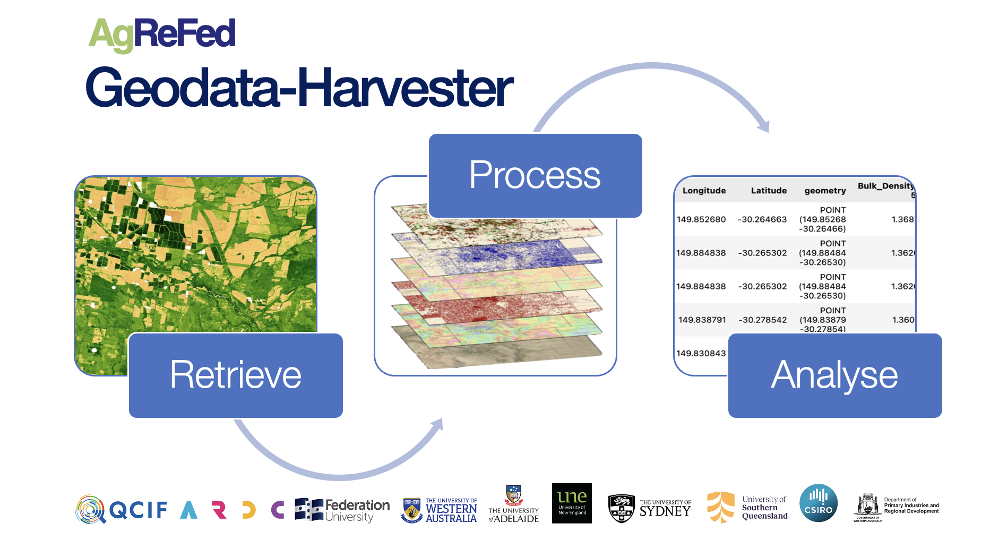

# Geodata-Harvester

<h3><em>Automate geodata harvesting from the web and jumpstart your analysis with a ready-made set of spatial-temporal processed maps and dataframes.</em></h3> 

<center><a></a></center>


<!-- Badges  start -->

[](#license)

<!-- [](https://github.com/Sydney-Informatics-Hub/AgReFed-DataHarvester/releases/)
[](https://github.com/Sydney-Informatics-Hub/AgReFed-DataHarvester/issues) -->

<!-- Badges end -->

The Geodata-Harvester Python package offers reusable and automated workflows for data extraction from a wide range of geospatial and environmental data sources. User provided data is auto-completed with a suitable set of spatial- and temporal-aligned covariates as a ready-made dataset for machine learning and environmental models. In addition, all requested data layer maps are automatically extracted and aligned for a specific region and time period.

For the R-package wrapper of the Geodata-Harvester, please visit the [Github dataharvesteR project](https://github.com/Sydney-Informatics-Hub/dataharvester).

## Content

- [Introduction](#introduction)
- [Data Sources](#data-sources)
- [Functionality](#functionality)
- [Key Features](#key-features)
- [Installation](#installation)
- [How to get started](#how-to-get-started)
- [How to add new data source modules](#how-to-add-new-data-source-modules)
- [Contributions](#contributions)
- [Attribution and Acknowledgments](#attribution-and-acknowledgments)
- [License](#license)


## Introduction

There is an enormous amount of national/global space-time data that is free and accessible. Examples are the numerous satellite platforms, weather, soil landscape grid of Australia. Many have a temporal dimension so for any point in Australia you can extract a time series of remote sensing and weather data and soil and terrain site variables. In the case of time series covariates there are a number of post-processing steps that a user can undertake to extract meaning, e.g. temporal means, aggregating in time. All of the above is a non-trivial task and a workflow where a user could enter a point (s) and get a tidy data frame of data cube variables would be a step towards people understanding its value and being able to jumpstart their analysis. This project will contribute processing tools for finding, extracting and converting these key data layers.

Developed as part of the Agricultural Research Federation (AgReFed), Geodata-Harvester is an open-source software that allows users to jumpstart their analysis with a suitable set of spatial-temporal aligned raster maps and dataframes.

## Data Sources

A detailed list of all available layers and their description can be found in [Data Overview](quarto/docs/Data_Overview.md).

The following main data sources are currently implemented:

- Soil and Landscape Grid of Australia (SLGA)
- SILO Climate Database
- National Digital Elevation Model (DEM) 1 Second Hydrologically Enforced
- Digital Earth Australia (DEA) Geoscience Earth Observations
- GSKY Data Server for DEA Geoscience Earth Observations
- Radiometric Data
- Google Earth Engine Data (GEE account needed), see for overview [Earth_Engine_Data_Overview](quarto/docs/Earth_Engine_Data_Overview.md).

## Functionality

The main goal of the Data Harvester is to enable researchers with reusable workflows for automatic data extraction and processing:

1. Retrieve: given set of locations, automatically access and download multiple data sources (APIs) from a diverse range of geospatial and soil data sources
2. Process: Spatial and temporal processing, conversion to dataframes and custom raster-files
3. Output: Ready-made dataset for machine learning (training set and prediction mapping)

Geodata-Harvester is designed as a modular and maintainable project in the form of a multi-stage pipeline by providing explicit boundaries among tasks. To encourage interaction and experimentation with the pipeline, multiple frontend notebooks and use case scenarios are provided.

## Key Features

Below is a list of features available for the geodata-harvester package. Please check the project Github webpage and notebooks for examples, data selection, and other settings.

- enabling reproducible workflows via YAML settings files
- automatic data retrieval from geodata APIs for given locations and dates
- automatic download and spatial-temporal processing of geo-spatial maps for user-specified bounding box, resolution, and time-scale.
- support for multiple temporal aggregation options and spatial-temporal buffer
- automatic extraction of retrieved data into ready-made dataframes for ML training
- automatic generation of ready-made aligned maps and data for ML prediction models
- visualisation of downloaded and aligned maps
- support for saving and loading settings via interactive widgets
- with connectivity support to the Google Earth Engine API, perform petabyte-scale operations which include temporal cloud/shadow masking and automatic calculation of spectral indices


## Installation

Geodata-Harvester can be run on cloud-servers (e.g., in JupyterHub environment) or on your local machine. 
Example notebooks for importing and using the package can be found in the folder [notebooks](https://github.com/Sydney-Informatics-Hub/geodata-harvester/tree/main/notebooks). To install the package run one of the following

### Conda or Mamba install

The package geodata-harvester is available via the conda-forge channel:

```bash
conda install geodata-harvester -c conda-forge
```

Note that the geodata-harvester is imported with underscore as 

```Python
import geodata_harvester
```

### Pip install

Installation via pypi requires a pre-installation of gdal (see, e.g., [pypi.org/project/GDAL/installation guide](https://pypi.org/project/GDAL/)) in your environment. Once gdal is installed, you can install geodata-harvester via

```bash
pip install geodata-harvester
```
The geodata-harvester library can then be imported via

```Python
import geodata_harvester
```

### Requirements

If you like to develop Data Harvester locally, it is recommended to setup a virtual environment for the installation, e.g., via conda miniforge (see for dependencies `environment.yaml`).


## How to get started

You may now invoke the geodata-harvester directly from a python terminal with:

```python
import geodata_harvester as gh
gh.harvest.run()
```

**Note the subtle but important difference in use of an underscore `_` to import the package and the use of a dash `-` to install it!**

To get started, some example workflows are provided as Jupyter notebooks:

1. Options and user settings are defined by the user in the settings; see for settings documentation [Settings_Overview](quarto/docs/Settings_Overview.md)

2. Run the jupyter notebook in the folder [notebooks](https://github.com/Sydney-Informatics-Hub/geodata-harvester/tree/main/notebooks).

If you would like to learn more about the Geodata-Harvester, please visit our [Workshop webpage](https://sydney-informatics-hub.github.io/AgReFed-Workshop/).

## How to add new data source modules

The Geodata-Harvester is designed to be extendable and new data source modules can be added as Python modules (for examples, see `getdata_*.py` modules). If you would like to add a new data source, please follow the [adding new data source guidelines](quarto/docs/How_to_add_DataSources.md)  

We recommend to fork the geodata-harvester repo and develop new modules in a local environment. If you would like to contribute your data source module to the geodata-harvester package, please visit the [geodata-harvester contribution guidelines](quarto/docs/Contributing.md).


## Contributions
We are happy for any contribution to the geodata-harvester, whether feedbacks and bug reports via github Issues, adding use-case examples via notebook contributions, to improving source-code and adding new or updating existing data source modules. 

For more details about about how to contribute to the development, please visit the [Geodata-Harvester contribution guidelines](quarto/docs/Contributing.md).


## Attribution and Acknowledgments

This software was developed by the Sydney Informatics Hub, a core research facility of the University of Sydney, as part of the Data Harvesting project for the Agricultural Research Federation (AgReFed).

Acknowledgments are an important way for us to demonstrate the value we bring to your research. Your research outcomes are vital for ongoing funding of the Sydney Informatics Hub.

If you make use of this software for your research project, please include the following acknowledgment:

“This research was supported by the Sydney Informatics Hub, a Core Research Facility of the University of Sydney, and the Agricultural Research Federation (AgReFed)."

AgReFed is supported by the Australian Research Data Commons (ARDC) and the Australian Government through the National Collaborative Research Infrastructure Strategy (NCRIS).

## License

Copyright 2023 The University of Sydney

This is free software: you can redistribute it and/or modify it under
the terms of the GNU Lesser General Public License (LGPL version 3) as
published by the Free Software Foundation.

This program is distributed in the hope that it will be useful, but
WITHOUT ANY WARRANTY; without even the implied warranty of
MERCHANTABILITY or FITNESS FOR A PARTICULAR PURPOSE. See the GNU Lesser
General Public License for more details.

You should have received a copy of the GNU Lesser General Public License along with this program (see LICENSE). If not, see
<https://www.gnu.org/licenses/>.
